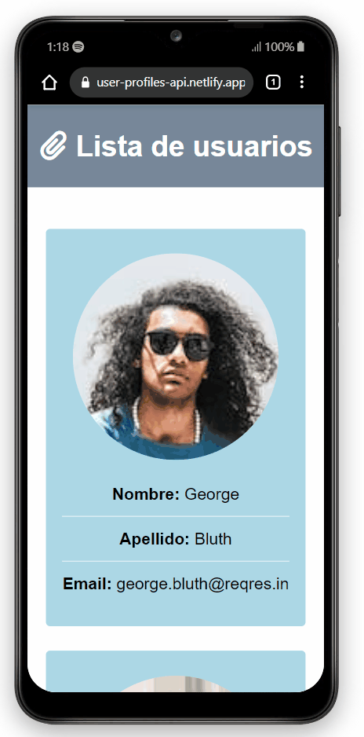

# User Profiles App

## 💡 Brief

In this project, I have created a website using React and consuming the REQRES public API. I have used various techniques and concepts to make the user experience enjoyable and efficient, such as the use of routing in React and different hooks to handle state and effects in the application. I have also carefully selected a color palette and typography to give the site a professional and attractive look.

- ### Desktop preview

- ### Mobile preview

## 🚀 Project was developed with

### 1. Languages

&nbsp;&nbsp;

### 2. Frameworks

### 3. APIs

  - REQRES: https://reqres.in/

### 4. Colors 

  - Gray: #778899
  - blue: #81b6c7
  - lightblue: #add8e6

### 5. Fonts

  - sans-serif 400, 500, 600

## 📖 New Concepts Mastered and Applied

  - Use of react-router-dom: BrowserRouter, HashRouter, Routes, Route, Navigate, NavLink
  - Hooks: useState, useEffect, useParams, useNavigate
  
## 🌍 Deployment on netlify and Website

You can try my final result [here](https://user-profiles-api.netlify.app/){:target="_blank"}

