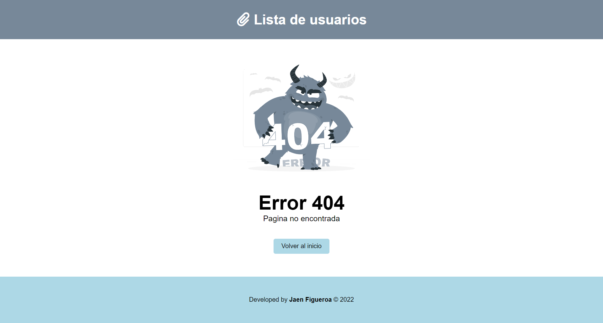

## User profiles api

## 💡 Brief

In this project I have created a website using react, consuming the public api req res

- ### Desktop preview

<!--  -->

<!-- - ### Mobile preview

 -->

## 🚀 Project finished

This project was developed with the following languages and frameworks:
      

&nbsp;&nbsp;

## 🌍 Website

You can try my final result [here](user-profiles-api.netlify.app/s).

